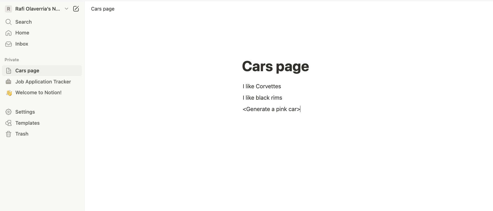
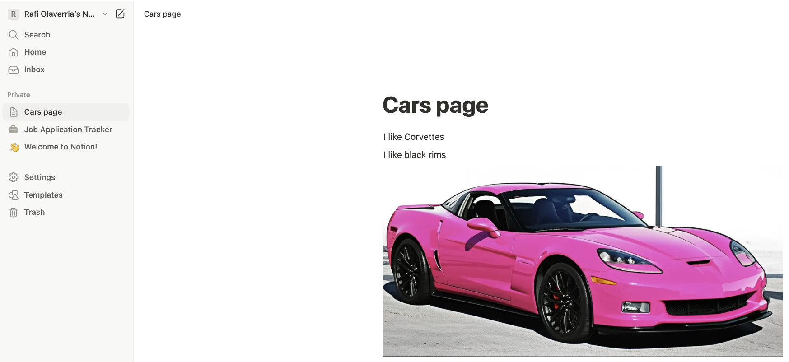

# Notion Asset Generator


This is a NestJS application that generates assets for Notion pages using the Gemini API. It listens for incoming requests from Notion, processes the content, and generates images(may add other assets). 

Built with [Nest](https://github.com/nestjs/nest) framework TypeScript starter repository.

## Requirements
- Node.js (v24 or later)
- [Create a Notion integration](https://developers.notion.com/docs/create-a-notion-integration) with access to the pages you want to generate assets for.
- [Setup webhooks](https://developers.notion.com/reference/webhooks) in Notion to send requests to this application. During the webhook setup, the service will send a `verification_token` to your application and will be visible in the application logs. 
- [Gemini API key](https://aistudio.google.com/apikey) to generate images.
- (Optional) [NGROK](https://ngrok.com/) or similar tool to expose your local server to the internet for testing webhooks.

## Project setup

```bash
$ npm install
```

## Environment Variables
```bash
$ cp .example.env .env
```
Update the `.env` file with your Notion and Gemini API keys. 
The `NOTION_VERIFICATION_TOKEN` is used to verify requests from Notion, and is optional. If not provided, the application will not verify requests. 

## Compile and run the project using Node/NPM
```bash
# development
$ npm run start

# watch mode
$ npm run start:dev

# production mode
$ npm run start:prod
```

## Compile and run the project using Docker

```bash
$ docker compose up --build
``` 

### Have some fun!
Once the application is running:
- Go to the desired Notion page.
- Add a paragraph block with your prompt between `<` and `>`. 
    - Example: `<Generate a pink car>`

<p align="center">
  
</p>

- Wait for the webhook to trigger and the image to be generated.
- The generated image will be added to the page as an image block and replace the placeholder.

<p align="center">
  
</p>